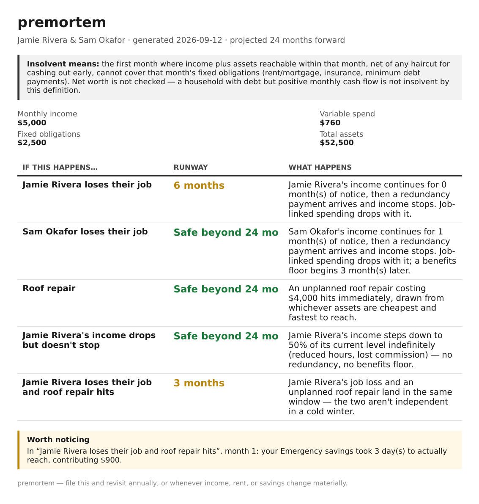

# premortem

*A fortune teller for your bank account — minus the crystal ball, plus a spreadsheet's worth of decimal precision.*

The world is unpredictable. Layoffs happen. Boilers die at 2am in January. A client disappears. Most of us cope with this by not thinking about it too hard — which works fine, right up until it doesn't.

`premortem` is a small personal project that does the thinking for you, in advance, so you're not doing it for the first time at 3am mid-panic. Answer a few honest questions about your income, expenses, assets, and debts, and it tells you — in months, precisely — how long you'd actually last against five specific bad days: losing your job, a major unplanned expense, your income quietly shrinking, someone else in the household losing their job, or several of these ganging up on you at once (the "cold winter" scenario).

It's not a budgeting app, and it doesn't care about your net worth. It asks one blunt question — *if the bad thing happens, when do you run out of money to cover rent?* — and answers it by actually simulating your assets draining in the order you could truly reach them, because "I have savings" and "I can spend that money this month" are not the same sentence.

## Sample output

*(Jamie, Sam, and their finances are entirely made up for this screenshot — this repo never ships or commits real household data.)*

## How it works

1. `./install.sh` — one-time setup: system libraries + a Python virtual environment.
2. `./run.sh elicit` — a guided terminal wizard asks about your household and saves it to a `.toml` file.
3. `./run.sh report your-household.toml -o report.pdf` — turns that file into a one-page PDF like the one above.

Everything runs locally. `.gitignore` refuses to let a real household file or a generated PDF anywhere near a commit, on purpose.

## Assumptions

Simplifications the model makes, in the direction they bias the result:

- **No interest on debt.** Each debt is a minimum monthly payment against a balance, amortized straight-line with no interest. A real loan's balance falls slower than that, so the payment can drop out of the simulation — and runway look better — sooner than it would in reality.
- **Assets become reachable in 30-day steps.** An asset's `access_days` is bucketed into whole months (`ceil(access_days / 30)`), so a 30-day asset counts as reachable in month 1 and a 31-day asset in month 2. That rounding can shift an insolvency date by a month either way.
- **A benefits floor is a floor, not a top-up.** Once it starts, a person's income is `max(what they earn, the floor)` for the rest of the horizon. That's right for flat, work-contingent benefits (it stops mattering the month a new job pays more than it) and optimistic for anything means-tested that would taper instead of vanish; it never models benefits being withdrawn outright.
- **Discretionary spend is cut, not assets sold, while a shock is depressing income.** A household simulated as fully employed still funds takeaways and streaming from savings if it wants to; one whose income is currently below baseline (job loss, reduced hours) is modelled as cutting that spending first, and only resumes funding it from assets once income recovers.

## Why this exists

A small, for-fun side project — an attempt to turn "I should really think about what would happen if..." into an actual number instead of a background hum of anxiety. If it's useful to you too, even better.

---

Built by [Uroš Drnovšek](https://github.com/urosdrnovsek).
